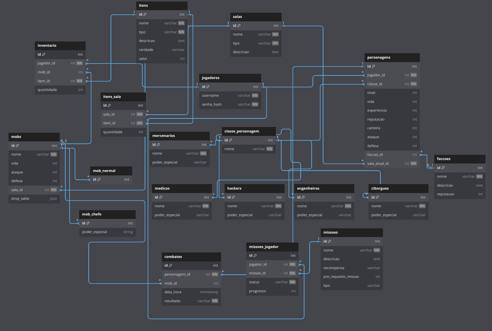

# **Modelo Relacional – MREL**

O modelo relacional (MREL) é uma abordagem amplamente utilizada para a organização e gerenciamento de dados em sistemas de banco de dados. Ele se baseia em conceitos matemáticos de conjuntos e relações, permitindo a representação estruturada e eficiente de informações. Este documento apresenta os principais conceitos, definições e aplicações do modelo relacional, servindo como referência para o entendimento e implementação de sistemas baseados nesse paradigma.

## Histórico de Versão
| Versão | Data       | Descrição                                         | Autor(es)                                                                       |
| :---:  | :--------: | :------------------------------------------------ | :------------------------------------------------------------------------------- |
| `1.0`  | 30/04/2025 | Adição do Modelo Relacional                       | [Guilherme Basílio](https://github.com/GuilhermeBES)                             |
| `1.1`  | 01/05/2025 | Inclusão do diagrama do modelo relacional e ajustes de documentação | [Vinicius Vieira](https://github.com/viniciusvieira00) |
