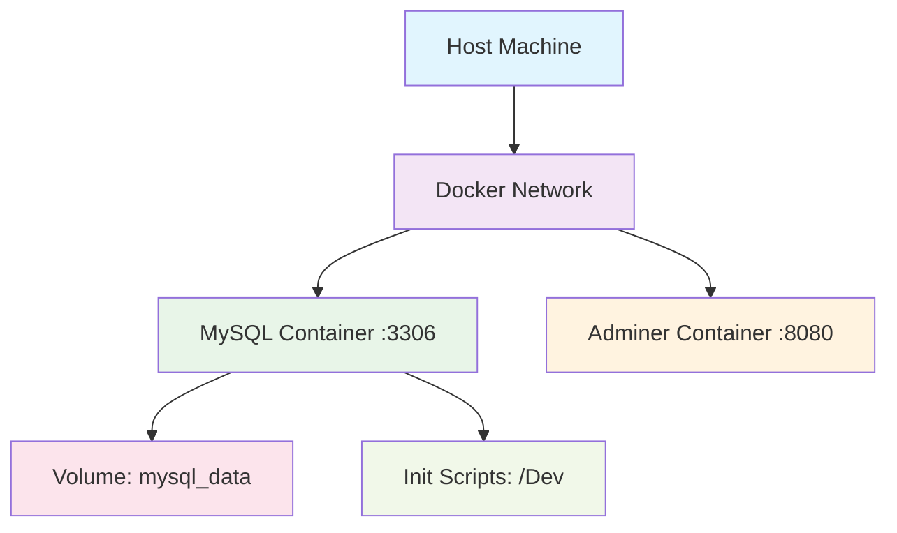

# **Infraestrutura Docker - Módulo 2**

A containerização é uma tecnologia essencial para o desenvolvimento moderno de software, permitindo criar ambientes isolados, consistentes e facilmente replicáveis. Este documento apresenta a implementação completa da infraestrutura Docker para o projeto District ZER0, incluindo a configuração de serviços, automação com Makefile e scripts auxiliares.

## 🐳 Arquivos de Infraestrutura

### **docker-compose.yml** - Orquestração de Serviços

Arquivo principal de configuração que define e coordena os serviços necessários para o funcionamento do sistema.

#### **Serviços Implementados**

##### **MySQL Database**
```yaml
mysql:
  image: mysql:8.0
  container_name: district_zero_mysql
  environment:
    MYSQL_ROOT_PASSWORD: root_password
    MYSQL_DATABASE: district_zero
    MYSQL_USER: district_zero_user
    MYSQL_PASSWORD: district_zero_pass
  ports:
    - "3306:3306"
  volumes:
    - mysql_data:/var/lib/mysql
    - ./Dev:/docker-entrypoint-initdb.d
```

**Características:**
- **Versão estável**: MySQL 8.0 LTS
- **Inicialização automática**: Scripts SQL executados na primeira inicialização
- **Persistência**: Volume nomeado para dados duráveis
- **Configurações personalizadas**: Variáveis de ambiente específicas do projeto

##### **Adminer - Interface Web**
```yaml
adminer:
  image: adminer:latest
  container_name: district_zero_adminer
  ports:
    - "8080:8080"
  depends_on:
    - mysql
```

**Funcionalidades:**
- **Interface visual**: Gerenciamento de banco via navegador
- **Dependência**: Aguarda MySQL estar disponível
- **Acesso simplificado**: http://localhost:8080

#### **Configurações Avançadas**

##### **Volumes**
```yaml
volumes:
  mysql_data:
    driver: local
```

##### **Networks**
```yaml
networks:
  default:
    name: district_zero_network
```

### **Makefile** - Automação de Comandos

Sistema de automação que simplifica operações complexas em comandos simples e memorizáveis.

#### **Comandos Principais**

##### **Setup de Ambiente**
```makefile
setup:
	@echo "🔍 Verificando dependências..."
	@command -v docker >/dev/null 2>&1 || (echo "❌ Docker não encontrado" && exit 1)
	@command -v docker-compose >/dev/null 2>&1 || (echo "❌ Docker Compose não encontrado" && exit 1)
	@echo "✅ Dependências OK"
```

##### **Gestão de Serviços**
```makefile
start:
	@echo "🚀 Iniciando serviços..."
	docker-compose up -d
	@echo "⏳ Aguardando inicialização do MySQL..."
	@sleep 30
	@echo "✅ Serviços iniciados"

stop:
	@echo "🛑 Parando serviços..."
	docker-compose down
	@echo "✅ Serviços parados"

restart:
	@echo "🔄 Reiniciando serviços..."
	$(MAKE) stop
	$(MAKE) start
```

##### **Testes e Validação**
```makefile
test:
	@echo "🧪 Executando queries de teste..."
	docker exec -i district_zero_mysql mysql -u district_zero_user -p district_zero_pass district_zero < Dev/DQL_mysql.sql
	@echo "✅ Testes executados"

health:
	@echo "🏥 Verificando saúde dos serviços..."
	@./scripts/health-check.sh
```

##### **Backup e Restore**
```makefile
backup:
	@echo "💾 Criando backup..."
	docker exec district_zero_mysql mysqldump -u district_zero_user -p district_zero_pass district_zero > district_zero_$(shell date +%Y%m%d_%H%M%S).sql
	@echo "✅ Backup criado"

restore:
	@echo "🔄 Restaurando backup..."
	docker exec -i district_zero_mysql mysql -u district_zero_user -p district_zero_pass district_zero < $(BACKUP_FILE)
	@echo "✅ Backup restaurado"
```

### **.env.example** - Configuração de Ambiente

Template de configuração que permite personalização sem modificar arquivos principais.

```env
# Configurações do MySQL
MYSQL_ROOT_PASSWORD=root_password
MYSQL_DATABASE=district_zero
MYSQL_USER=district_zero_user
MYSQL_PASSWORD=district_zero_pass
MYSQL_PORT=3306

# Configurações do Adminer
ADMINER_PORT=8080

# Configurações de Desenvolvimento
COMPOSE_PROJECT_NAME=district_zero
```

**Vantagens:**
- **Flexibilidade**: Personalização sem modificar arquivos versionados
- **Segurança**: Senhas personalizadas
- **Portabilidade**: Configurações específicas por ambiente

## 🔧 Scripts Auxiliares

### **scripts/health-check.sh** - Verificação de Saúde

Script automatizado para verificar o status dos serviços.

```bash
#!/bin/bash

echo "🔍 Verificando status dos containers..."
docker-compose ps

echo "🔍 Testando conexão com MySQL..."
docker exec district_zero_mysql mysql -u district_zero_user -p district_zero_pass -e "SELECT 'MySQL OK' as status;"

echo "🔍 Verificando Adminer..."
curl -f http://localhost:8080 > /dev/null 2>&1 && echo "✅ Adminer OK" || echo "❌ Adminer indisponível"

echo "🔍 Verificando estrutura do banco..."
docker exec district_zero_mysql mysql -u district_zero_user -p district_zero_pass district_zero -e "SHOW TABLES;"
```

**Funcionalidades:**
- **Status de containers**: Verificação de estado
- **Conectividade**: Teste de conexão com banco
- **Integridade**: Validação de estrutura

## 🌐 Arquitetura de Rede

### **Comunicação entre Serviços**



### **Mapeamento de Portas**
- **MySQL**: Host:3306 → Container:3306
- **Adminer**: Host:8080 → Container:8080

### **Volumes e Persistência**
- **mysql_data**: Dados do banco persistem entre restarts
- **Init scripts**: Arquivos SQL montados para inicialização

## 🔄 Fluxo de Inicialização

### **Sequência de Startup**

1. **Docker Compose**: Inicia orquestração
2. **MySQL Container**: Criação e configuração
3. **Init Scripts**: Execução automática dos SQLs
4. **Adminer Container**: Interface web disponível
5. **Health Check**: Validação de serviços

### **Scripts de Inicialização**

Os arquivos na pasta `Dev/` são executados automaticamente na primeira inicialização do MySQL:

1. **00_init.sql**: Configurações iniciais
2. **DDL_mysql.sql**: Estrutura das tabelas
3. **DML_mysql.sql**: Dados iniciais

## 📊 Monitoramento e Logs

### **Comandos de Diagnóstico**

```makefile
logs:
	@echo "📋 Exibindo logs dos serviços..."
	docker-compose logs -f

logs-mysql:
	@echo "📋 Logs do MySQL..."
	docker logs district_zero_mysql -f

logs-adminer:
	@echo "📋 Logs do Adminer..."
	docker logs district_zero_adminer -f
```

### **Métricas de Sistema**

```makefile
stats:
	@echo "📊 Estatísticas dos containers..."
	docker stats district_zero_mysql district_zero_adminer
```

## 🛠️ Comandos de Desenvolvimento

### **Acesso Direto ao Banco**

```makefile
connect-db:
	@echo "🔌 Conectando ao MySQL..."
	docker exec -it district_zero_mysql mysql -u district_zero_user -p district_zero_pass district_zero

mysql-cli:
	@echo "🔌 Conectando como root..."
	docker exec -it district_zero_mysql mysql -u root -p
```

### **Limpeza de Ambiente**

```makefile
clean:
	@echo "🧹 Limpando ambiente..."
	@echo "⚠️  ATENÇÃO: Isso apagará todos os dados!"
	@read -p "Confirma? (y/N): " confirm && [ "$$confirm" = "y" ]
	docker-compose down -v
	docker system prune -f
	@echo "✅ Ambiente limpo"
```

## 🎯 Demonstração Automatizada

### **Comando de Entrega**

```makefile
entrega: setup start test health
	@echo "🎉 Ambiente pronto para demonstração!"
	@echo ""
	@echo "📋 Acesse:"
	@echo "   🌐 Adminer: http://localhost:8080"
	@echo "   🔑 Usuário: district_zero_user"
	@echo "   🗝️  Senha: district_zero_pass"
	@echo "   🗄️  Database: district_zero"
	@echo ""
	@echo "🧪 Execute 'make test' para ver queries de exemplo"
```

## 🔒 Configurações de Segurança

### **Isolamento de Rede**
- Containers em rede isolada
- Portas expostas apenas conforme necessário
- Comunicação interna segura

### **Gerenciamento de Credenciais**
- Senhas através de variáveis de ambiente
- Arquivo `.env` não versionado
- Template `.env.example` para referência

### **Volumes Seguros**
- Dados persistentes em volumes nomeados
- Separação entre dados e código
- Backup facilitado

## 📈 Vantagens da Implementação

### **Para Desenvolvimento**
- **Ambiente consistente**: Mesma configuração em qualquer máquina
- **Setup rápido**: Um comando inicia todo o ambiente
- **Isolamento**: Não interfere com outras instalações

### **Para Demonstração**
- **Facilidade**: Professor pode executar facilmente
- **Confiabilidade**: Ambiente controlado e testado
- **Documentação**: Comandos claros e bem documentados

### **Para Manutenção**
- **Logs centralizados**: Facilita debugging
- **Backup automatizado**: Proteção de dados
- **Monitoramento**: Visibilidade do sistema

## Histórico de Versão

| Versão |    Data    |                        Descrição                        |                       Autor(es)                        |
| :----: | :--------: | :-----------------------------------------------------: | :----------------------------------------------------: |
| `1.0`  | 12/06/2025 | Criação da documentação de infraestrutura Docker       | [Vinicius Vieira](https://github.com/viniciusvieira00) | 